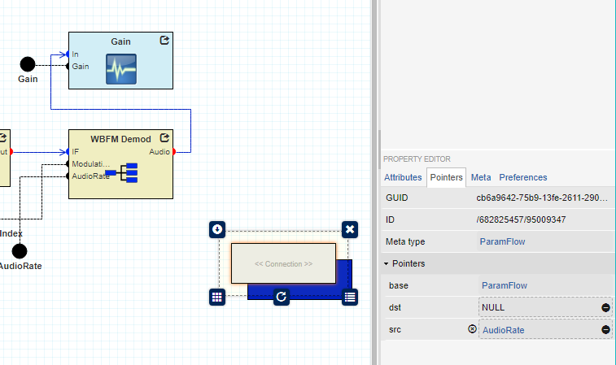

# Decorator for Connection Removal
This decorator is intended to be registered at connections in the Model Editor. At the point where a connection is 
no longer rendered as a line - the decorator will trigger a removal of the connection node.

The removal is triggered whenever a `src` and `dst` is defined for the node, but one of the targets is either `null` or
`undefined`. Before the removal the decorator ensure that the model isn't read-only, a meta-node nor an inherited child.



## Import decorator to your own webgme repository
Make sure [webgme-cli](https://github.com/webgme/webgme-cli) is installed globally in npm, then execute from root of your repository:
```
webgme import decorator ConnRemoverDecorator webgme-connection-remover
```

## Developers

#### Publish new release at npm
 ```
 npm prune
 npm install
 npm version 1.1.0 -m "Release %s"
 git push origin master
 git checkout v1.1.0
 git push origin v1.1.0
 npm publish ./
 ```